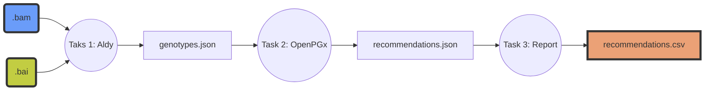

# Pharmacogenomics recommendations

## Overview

Pharmacongeomics recommendations project contains workflow implemented in openWDL language. Workflow creates pharmacogenomics drug recommendations based on genotype calculated from provided input **BAM**.



## Execution

1. Prepare input in json file:

```json
{
    "pgx_workflow.bam": "<path_to_bam>",
    "pgx_workflow.bai": "<path_to_bai>"
}
```

2. Run the workflow

```bash
$ cromwell run -i inputs.json ./wdl/pgx_workflow.wdl
```

## Inputs

- The input for the workflow is **BAM** file with index (**BAI**).

- Supported technology: *Illumina*
- Must be mapped to hg19 (GRCh37) or hg38 (GRCh38).

## Outputs

The outputs are gene/drug related recommendations based on CPIC, DWP and FDA data. 

Some examples:
- csv example: `./examples/recommendations.csv`
- display in jupyter notebook: `./examples/recommendations_presentation.ipynb`

## Steps of the workflow

### 1. Aldy
This step executes **Aldy** tool: https://aldy.readthedocs.io/en/latest/readme.html#,
*© 2016-2022 Aldy Authors, Indiana University Bloomington. All rights reserved*

Aldy calls genotypes of many pharmacogenes and reports them in star-allele nomenclature. Scientific csv reports from genotyping are converted to json, choosing first solution/result provided by Aldy for each specific gene. 

### 2. OpenPGX
This step creates gene/drug related recommendations for the person whose genome was inserted into the pipeline as BAM. Step executes **OpenPGx** software: https://github.com/monigenomi/openpgx (@monigenomi, @sheerun).

### 3. Report
This step creates csv file with recommendations.

## Testing and development

- Preare files needed for testing (curl and samtools required):

```
$ bash wdl/aldy/test/bam/get_bam_test_files.sh
```

- install *cromwell*

- install development requirements:
```
$ pip install requirements.txt
```
- test using pytest

```
$ pytest
```

## Licensing
For academic and non-commercial as a reason of **Aldy license**:

© 2016-2022 Aldy Authors, Indiana University Bloomington. All rights reserved.
Aldy software implemented in the pipeline can be freely used in academic and non-commercial environments.


